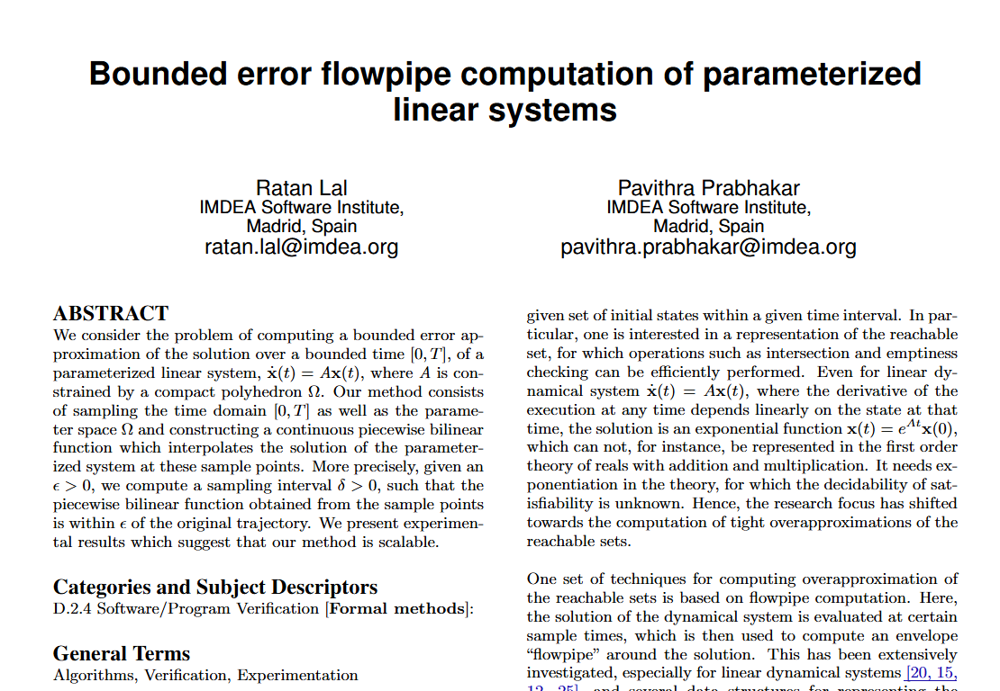

This is the main content of your first news post. You can write as much as you want here. You can use standard Markdown to format your text.

For example, you can have:

- Bulleted lists
- **Bold text** or _italic text_
- And, of course, you can add images directly into the article content.

### An Image Inside the Post

Here is how you place an image within the body of your post. This is separate from the "featured image" defined in the front matter above.

You can continue writing more paragraphs after the image. This format gives you full control over the layout of your article page.
