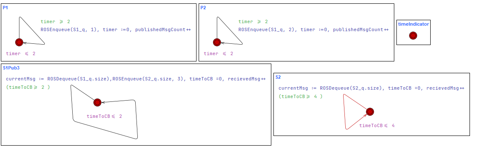

 

This project develops a formal model of the publisher–subscriber communication paradigm in ROS 2 to enable rigorous analysis and verification of robotic applications. Using UPPAAL, a model checker for real-time systems, we translate ROS programs into networks of timed automata with queues, capturing essential message-passing semantics such as timers, delays, and message loss. Our framework provides correctness guarantees for safety properties and helps identify system configurations that prevent message loss. We demonstrate the approach on case studies including the ROS Navigation Stack and a 3D obstacle detection module, showing how formal verification can ensure reliable communication in safety-critical robotic systems.

