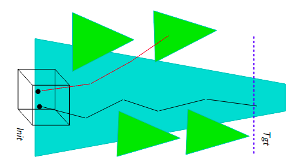

 

This project introduces a formal verification framework to ensure the safety of camera-based autonomous vehicles operating within synthetic 3D environments. The primary problem is to certify that a vehicle, starting from any point within an initial region, will navigate to a target area without colliding with any obstacles in a complex 3D-scene. This challenge is addressed by introducing the concept of "interval images," which abstractly represent all possible images seen from a region, and combining it with an abstraction-refinement algorithm to efficiently and scalably verify the system's safety.

